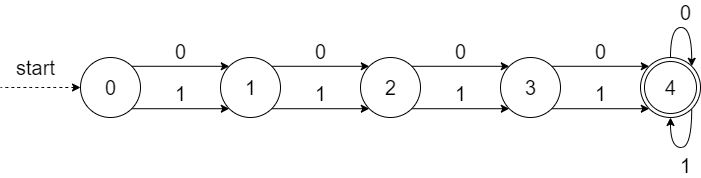
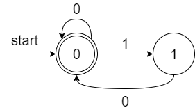
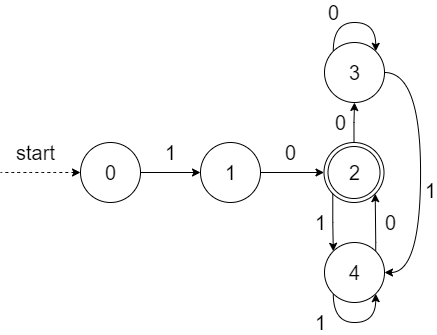
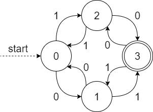
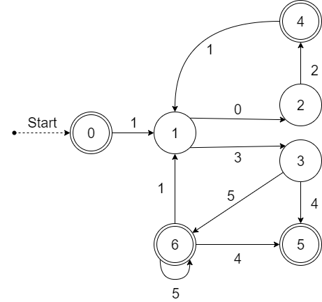
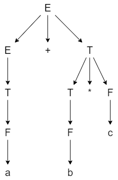
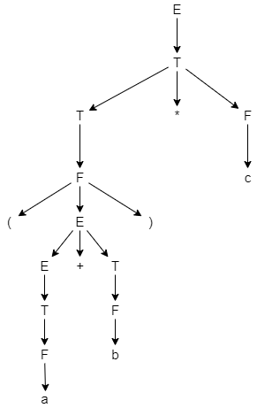
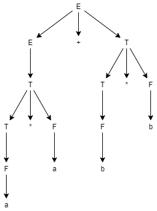
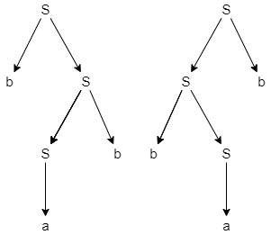

# Assignment 4 - ol222hf

## Table of Contents
[TOC]

# Exercises

## Exercise 1

Construct a regular expression and a deterministic automaton that accept each of the following languages over {0, 1}.

### a)

Strings that do not contain 11.
regex → (0|10)*1?

 

### b)

Strings that contain at least four symbols.

regex → (0|1)(0|1)(0|1)(0|1)⁺

 

### c)

Strings where each 1 is directly followed by 0.
regex → (0|10)*

 

### d)

Strings that both start and end with 10.
regex → 10((1|0)*10)?

 

### e)

Strings having an odd number of 0s and an odd number of 1s.
regex → (11|00)\*(10|01)(00|11)\*((00|11)\*(01|10)(11|00)\*(10|01)(00|11)\*)\*

 

## Exercise 2

Present a Deterministic Finite Automaton and a Regular Expression for the language over {0, 1, 2, 3, 4, 5} where each string satisfies all of the following criteria: 

- The string may either be empty or start with 1.
- Either 0 or 3 must follow after 1.
- 2 must follow after 0.
- 1 may follow after 2, otherwise the string must end.
- 4 may follow after 3, but there may be zero or more 5’s between 3 and 4.
- 1 may follow after 5, otherwise the string must end.

------

Regex → (1(021|35*1)\*(02|35\*4?))?

 

## Exercise 3

Give context-free grammars for the following languages over {0, 1}.

### a)

Strings that both start and end with 10.

CFG:
A → 10 | 10B10
B → 1B | 0B | ε

### b) 

Strings that do not contain 11.

CFG:
A → 0A | 10A | 1 | ε

### c) 

Strings that contain at least four symbols.

CFG:
A → BBBB
B → 0B | 1B | 0 | 1

### d) 

L = {0^n 1^2n , n >=1}.

CFG: 
A → 0A11 | 011

### e) 

Palindromes. A palindrome is a non-empty string that has the same sequence of symbols when read forwards or backwards.

CFG:
A → 1A1 | 0A0 | 1 | 0 | ε

## Exercise 4

Consider the following grammar for arithmetic expressions:

E → E + T | T, 
T → T * F | F, 
F → a | b | c | (E)

Give parse trees for the each of the following strings:

### a)

a + b * c

 

### b)

(a + b) * c

### c)

a * a + b * b

## Exercise 5

Show that the grammar below is ambiguous:
S → bS | Sb | a

 
