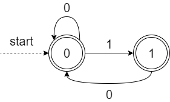
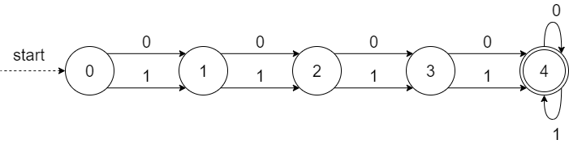
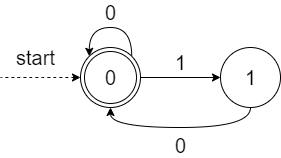
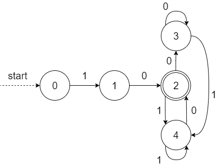
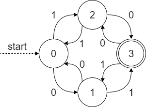

# Assignment 4 - ol222hf

## Table of Contents
[TOC]

# Exercises

## Exercise 1

Language used:
Σ = {0, 1}

### a)

Strings that do not contain 11.
regex = (0|10)*1?

 

### b)

Strings that contain at least four symbols.
regex = (0|1)(0|1)(0|1)(0|1)+

 

### c)

Strings where each 1 is directly followed by 0.
regex = (0|10)*

 

### d)

Strings that both start and end with 10.
regex = 10((1|0)*10)?

 

### e)

Strings having an odd number of 0s and an odd number of 1s.
regex = ?

 

## Exercise 2

Present a Deterministic Finite Automaton and a Regular Expression for the language over {0, 1, 2, 3, 4, 5} where each string satisfies all of the following criteria: 

- The string may either be empty or start with 1.
- Either 0 or 3 must follow after 1.
- 2 must follow after 0.
- 1 may follow after 2, otherwise the string must end.
- 4 must follow after 3, but there may be zero or more 5’s between 3 and 4.
- 1 may follow after 5, otherwise the string must end.
